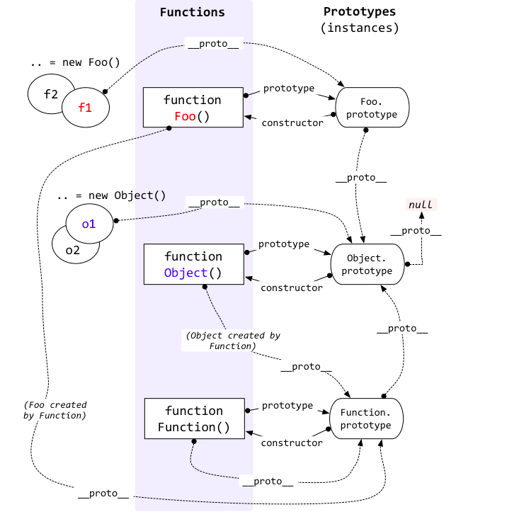

# JavaScript的进阶学习笔记

## 数据类型的判断方法

1. typeof

缺陷：
   1. 判断`null`时，会返回`object`。
   2. 判断除函数会返回`function`外，其他对象会返回`object`。

2. instanceof

用于判断该实例对象是否属于该构造函数。

3. 实例.constructor

可直接判断其构造函数。

4. Object.prototype.toString.call

最完美的类型检验方式，会输出`[object 首字母大写的类型字符串]`。

## undefined和null的理解

`undefined`表示未定义，而`null`表示内容为空。

## 变量在内存中存储的形式

1. 栈内存
2. 堆内存

基本类型数据存储在栈内存中，而引用类型会在堆内存中开辟空间存储数据，而在栈内存中保存指向堆内存的指针。因此基本数据类型赋值会得到全新的值，引用数据类型赋值只会得到相同的指针。

## 内存、数据、变量三者关系

内存中存储数据，变量名作为找到该数据存储位置的标识。

## 对象使用时的注意事项

对象作为函数的实参，将指针赋值给形参，形参在对堆内存中的数据修改时，会影响到函数外的对象。

```javascript
let o = {n: 1};
function add1 (x) {
  x.n += 1;
}
add1(o);
console.log(o.n); // 2
```

## 变量对内存的影响

变量有：全局变量、局部变量，数据又可以分为基本类型数据和引用类型数据。全局变量会一直消耗内存，而局部变量里基本类型数据用完立即被释放，引用数据类型如果函数执行完毕后还有使用，就不会被立即释放。

总结：全局变量和在函数外有引用的函数内部变量会不断消耗内存。

```javascript
let num = 1; // 在文档未被刷新前，一直在内存中。
function getAdd1Func () {
  function add1 (x) {
    return x + 1;
  }
  return add1;
}
let add1 = getAdd1Func(); // getAdd1Func执行完毕，由于返回add1函数，add1函数作为函数getAdd1Func的局部变量，不会被立即释放，直至add1函数被执行完毕。
num = add1(num);
```

## 对象属性或方法的引用方式

1. `对象.属性名`
2. `对象[属性名|变量]`

第一种方式的属性名必须满足标识符的命名规则，而第二种方式更加多元化，可以是任意类型数据，好处是可以使用变量，不局限于字符串，并且可以避开标识符的命名规则。

```javascript
let name = 'yxl';
let person = {
  'wq': {
    age: 18,
    sex: '女',
  },
  'yxl': {
    age: 18,
    sex: '男',
  },
  'Jon Jack': {
    age: 18,
    sex: '男',
  },
};
console.log(person[name].sex); // 男，通过变量作为属性名的形式查询
console.log(person['Jon Jack'].sex); // 男，通过该查询方式，可以避开标识符的命名规范
```

注意：**不推荐使用对象作为对象的属性名，因为对象的属性名会自动转换为字符串，而对象通过`toString`来转换为字符串，任何对象都会转为`[object Object]`，从而发生对象取值错误的情况**

## 函数的调用方式

除了正常的调用方式，还可以通过`bind`、`apply`和`call`来调用。

```javascript

let p1 = {
  name: 'yxl',
  like: 'play computer games',
  love() {
    console.log(`${this.name} ${this.like}`);
  },
};

let p2 = {
  name: 'wq',
  like: 'play football',
};

console.log(p1.love());
console.log(p1.love.call(p2));

```

## 回调函数的定义

在函数A中使用函数B作为形参，在外部调用A，传入函数B作为实参，函数B的执行时机由函数内部如何执行该形参来决定，函数B就为回调函数。

## IIFE（Immediately-Invoked Function Expression，立即执行函数）的作用

形成一个封闭的函数的函数作用域，避免产生全局变量，减少内存的浪费。

## 语句末尾是否加分号讨论

可以加可以不加，根据个人的习惯，必须加分号的几种情况：

1. 语句开头为`(`
2. 语句开头为`[`

解决办法：在这两种情况的开头加上一个`;`。

## 原型链

实例对象通过`__proto__`且构造函数通过`prototype`连接其原型上组成的链条。



## instanceof函数的运行

`A instanceof B`，是通过在A的原型链上能否找到B的显式原型。

## 变量提升和函数提升的注意事项

- 变量声明会在代码执行前，提升到当前作用域的顶部。
- 函数声明同样也会在代码执行前，提升到当前作用域顶部
- 变量声明优先于函数声明，因此同名的变量和函数，变量声明会被函数声明覆盖。

## JavaScript中的执行上下文和执行栈的理解

[详细](https://juejin.cn/post/6844903682283143181)


## 作用域的一个问题

```javascript
function x (x = 1) {
  console.log(typeof x); // x：number ？ or function ？
  // 函数x的作用域是window,而内部的形参x是函数作用域。
}
```

## 作用域的理解

规定了如何查找变量，在函数定义时就已经固定。

```javascript
var a = 1;
function who (a) {
  consoleA();
}
function consoleA() {
  console.log(a); // 在js中，函数的作用域在函数定义时就已经确定。
}
who(2); // 1
```

## 作用域和执行上下文的理解

作用域像是一个规则，用于规定在哪儿查找变量，在函数定义时就已经固定，而执行上下文像是一个容器，包含了当前环境的可使用的变量。执行代码时，会形成一个个执行上下文，依据不同的作用域在对应的执行上下文中查找变量。

## 闭包的注意事项

### 闭包的理解

这个函数的执行上下文除了保存自身的环境，还链接了其他函数的执行上下文。这个函数就形成了闭包。换而言之，闭包能够在一个函数中访问到另一个函数的变量，在Javascript函数的嵌套内层函数会形成闭包。若将闭包作为函数的返回值，会导致外层函数在执行完毕后，其执行上下文不会被销毁，直到等待形成闭包的函数被执行完毕后，才会被销毁。

[详细](https://developer.mozilla.org/zh-CN/docs/Web/JavaScript/Closures#:~:text=%E9%97%AD%E5%8C%85.%20%E4%B8%80%E4%B8%AA%E5%87%BD%E6%95%B0%E5%92%8C%E5%AF%B9%E5%85%B6%E5%91%A8%E5%9B%B4%E7%8A%B6%E6%80%81%EF%BC%88%20lexical%20environment%EF%BC%8C%E8%AF%8D%E6%B3%95%E7%8E%AF%E5%A2%83%20%EF%BC%89%E7%9A%84%E5%BC%95%E7%94%A8%E6%8D%86%E7%BB%91%E5%9C%A8%E4%B8%80%E8%B5%B7%EF%BC%88%E6%88%96%E8%80%85%E8%AF%B4%E5%87%BD%E6%95%B0%E8%A2%AB%E5%BC%95%E7%94%A8%E5%8C%85%E5%9B%B4%EF%BC%89%EF%BC%8C%E8%BF%99%E6%A0%B7%E7%9A%84%E7%BB%84%E5%90%88%E5%B0%B1%E6%98%AF%20%E9%97%AD%E5%8C%85,%EF%BC%88%20closure%20%EF%BC%89%E3%80%82.%20%E4%B9%9F%E5%B0%B1%E6%98%AF%E8%AF%B4%EF%BC%8C%E9%97%AD%E5%8C%85%E8%AE%A9%E4%BD%A0%E5%8F%AF%E4%BB%A5%E5%9C%A8%E4%B8%80%E4%B8%AA%E5%86%85%E5%B1%82%E5%87%BD%E6%95%B0%E4%B8%AD%E8%AE%BF%E9%97%AE%E5%88%B0%E5%85%B6%E5%A4%96%E5%B1%82%E5%87%BD%E6%95%B0%E7%9A%84%E4%BD%9C%E7%94%A8%E5%9F%9F%E3%80%82.%20%E5%9C%A8%20JavaScript%20%E4%B8%AD%EF%BC%8C%E6%AF%8F%E5%BD%93%E5%88%9B%E5%BB%BA%E4%B8%80%E4%B8%AA%E5%87%BD%E6%95%B0%EF%BC%8C%E9%97%AD%E5%8C%85%E5%B0%B1%E4%BC%9A%E5%9C%A8%E5%87%BD%E6%95%B0%E5%88%9B%E5%BB%BA%E7%9A%84%E5%90%8C%E6%97%B6%E8%A2%AB%E5%88%9B%E5%BB%BA%E5%87%BA%E6%9D%A5%E3%80%82.)

### 闭包的作用

1. 推迟外层函数的执行上下文的销毁时间。
2. 提供私有变量的特权方法。

```javascript
// 第一种，利用闭包延长变量的生命周期
for(var i = 1; i < 11; i++) {
  (i => {
    setTimeout(() => console.log(i), 1000 * i)
  })(i);
}

// 第二种，提供私有变量的特权方法
function Me () {
  this.name = 'yxl';
  this.hobby = 'learning';
  var realHobby = 'play computer games';
  this.fact = () => console.log(`${this.name} like to ${realHobby}`);
}
let me= new Me();
console.log(`${me.name} like to ${me.hobby}`); // 我表面上喜欢学习。
console.log(me.fact()); // 我实际上喜欢打游戏，但是不敢把真实想法暴露。
```

### 闭包的缺点

作为函数返回值的特殊闭包，所链接的其他上文环境不会随着对应函数执行完毕后自动销毁，而是等到闭包执行后或者不被引用才会被销毁。

## 构造函数的继承注意事项

构造函数的继承主要继承两个方面：

1. 继承父构造函数的实例属性。
2. 继承父构造函数的原型对象。

```javascript
function SupCls (a, b) {
  this.a = a;
  this.b = b;
}
SupCls.prototype.ab = function () {
  console.log(this.a, this.b);
};
function SubCls(a, b, c, d) {
  SupCls.call(this, a, b); // 借用父构造函数，继承父构造函数的实例属性。
  this.c = c;
  this.d = d;
}
SubCls.prototype.__proto__ = SupCls.prototype; // 原型链继承，继承父构造函数原型链上的方法。
SubCls.prototype.abcd = function () {
  console.log(this.a, this.b, this.c, this.d);
};

let sub = new SubCls(1,2,3,4);
sub.ab();
sub.abcd();
```

## 浏览器的进程和线程的数量问题

浏览器可以是单进程或多进程，但都是多线程运行的。

## 浏览器内核的作用

内核（又称渲染引擎），用于渲染网页文档和解析执行JavaScript代码等工作。常见浏览器内核有：
1. `Gecko`，前Netscape浏览器所用的渲染引擎，后来在firefox浏览器中继续使用。
2. `Webkit`，苹果公司研发，用于safari浏览器，同时也被谷歌的chrome浏览器使用。
3. `Blink`，谷歌公司联同opera浏览器的公司共同研发的基于`Webkit`的新渲染引擎，后被微软的Edge浏览器使用。
4. `Presto`，opera浏览器的公司研发，后被弃用，转为使用`Blink`。
5. `Trident`，微软公司研发给IE浏览器使用的渲染引擎。

## 事件循环的注意事项

### 事件循环的理解

执行栈中执行同步代码，遇到异步操作，交给WebAPIs,WebAPIs执行异步操作完毕后，会将异步操作的回调函数放置到任务队列中，当执行栈栈空后，将任务队列中的回调函数调入栈中继续执行，以此循环直至执行完毕。


### 微任务和宏任务的执行顺序

任务队列中的任务分为宏任务和微任务。执行顺序是：先执行宏任务，执行完毕执行微任务，以此循环直至宏任务和微任务都执行完毕。

### 微任务和宏任务有哪些？

宏任务：
- script代码
- 定时器
- I/O
- Ajax

微任务：
- Promise
- async/await

## Worker的优缺点

优点：

Worker是多线程，和JavaScript解析执行不是同一个线程，因此可以使用Worker来做一些复杂的计算。

缺点：

- Worker不能操作DOM，因为在Worker中没有`document`这个对象。
- Worker不能跨域。
- 不同浏览器的兼容问题

## Worker的使用

```javascript
// index.html
let worker1 = new Worker('Worker.js'); // Worker.js必须和网页同源
worker1.onmessage = function (event) {
  console.log(event.data); // event.data保存worker1传来的数据
  worker1.postMessage({data: event.data + 1}); // postMessage向worker1传递数据
  worker1.terminate(); // 结束这个worker1线程
}
worker1.onerror = function (error) {
  // 接收在worker1运行过程中出现的错误
}

// worker1.js
/*
 * 也可以使用如下语法：
 * [this|self.]onmessage = function ....
 */
let onmessage = function (event) {
  console.log(event.data);
  postMessage({data: event.data * 2});
  close(); // 同worker.terminate()
}
onmessageerror = function (error) {
  console.log(error); // 发送的数据无法序列化时，会触发
}
```